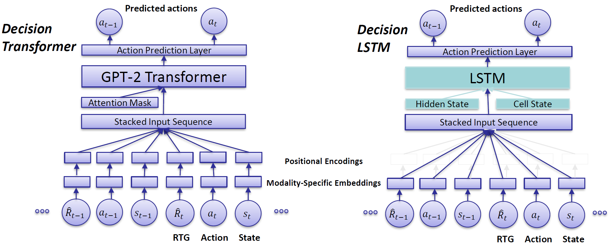

# Codebase for "How Crucial is Transformer in Decision Transformer?"

Max Siebenborn, Boris Belousov, Junning Huang, and Jan Peters

Link to our paper: [arXiv](https://arxiv.org/abs/2211.14655).
Accepted at NeurIPS FMDM workshop 2022.

## Acknowledgement
This repository is an extension of the original Decision Transformer codebase (https://github.com/kzl/decision-transformer) [1].
We adapted the code from the 'gym' folder of the original repo and extended it to be compatible with our experiments and architectures.

Original code for the 'clients' folder can be found here: https://git.ias.informatik.tu-darmstadt.de/quanser/clients .

## Overview 

We present *Decision LSTM*, an extension of Decision Transformer [1] that replaces the GPT-2 Transformer by a LSTM network.
To compare the architectures, we perform experiments on the Quanser Furuta,  a continuous control task requiring fine-grained stabilization.

The 'clients' folder contains the simulation framework for the Quanser Furuta pendulum.
Datasets and pre-trained models are found in the 'data' folder.
The 'src' folder contains the relevant experiment scripts and model architectures, adapted and extended from the original Decision Transformer repo.

## Main contributions
- Introduction of *Decision LSTM* as an architecture for offline reinforcement learning, 
- Experiment scripts on Quanser Furuta Pendulum to validate and compare the architectures, 
- Datasets and pre-trained models of Decision LSTM, Decision Transformer, and Behavioral Cloning on the experiments.

## Installation instructions
Follow the installation instructions of the original DT repo by running

```
conda env create -f conda_env.yml
```

Then, activate the created environment and install the 'quanser' package.

```
cd clients
pip3 install -e .
```

Now, download the datasets for the Furuta pendulum tasks from [this Drive folder](https://drive.google.com/drive/folders/1YdhZp-divm3AZ8sy3Bor0HeOI_F7RMAV?usp=share_link) and copy them into the 'data/datasets' folder.

## Experiment instructions

<!---### Create a custom dataset--->

### Training the models
To train a Decision LSTM model in the Qube environment, using the *swup-experiments* dataset, run the following command from the 'src' folder.
```
python experiment.py --env qube  --freq 250 --dataset swup-experiments --model_type dlstm  \
--device cpu --model_subfolder qube-swup-dlstm 
```

### Evaluating a saved model
The following example command will evaluate the trained DLSTM model (after 40-th training epoch) with ID 0099808 which is saved in the 'qube_swup' folder (run the script from the 'src/eval' folder). The pretrained model can also be found in the [Drive folder](https://drive.google.com/drive/folders/1YdhZp-divm3AZ8sy3Bor0HeOI_F7RMAV?usp=share_link).
```
python eval_model.py --env qube --freq 250 --dataset swup-experiments --model_iter 40  --rtg 6 \
--num_eval_episodes 20 --model_type dlstm --id 0099808 --model_subfolder qube_swup --data_json False \
```
To simulate the scene and observe what the model does, use the ```--render``` option.
To evaluate the model on the Qube stabilization task (pendulum starts upright and stabilized, no need to swing-up), use the ```--stabilize``` option.

## Citation
```
@inproceedings{
  siebenborn2022how,
  title={How Crucial is Transformer in Decision Transformer?},  
  author={Max Siebenborn and Boris Belousov and Junning Huang and Jan Peters},  
  booktitle={NeurIPS 2022 Foundation Models for Decision Making Workshop},  
  year={2022},  
  url={https://openreview.net/forum?id=RV6fghh1As_%7D}
}
```

## License
MIT

## References
<a id="1">[1]</a> 
L. Chen, K. Lu, A. Rajeswaran, K. Lee, A. Grover, M. Laskin, P. Abbeel, A. Srinivas, and I. Mordatch. 
Decision transformer: Reinforcement learning via sequence modeling. 
In *Advances in Neural Information Processing Systems (NeurIPS)*, pages 15084–15097, 2021.
