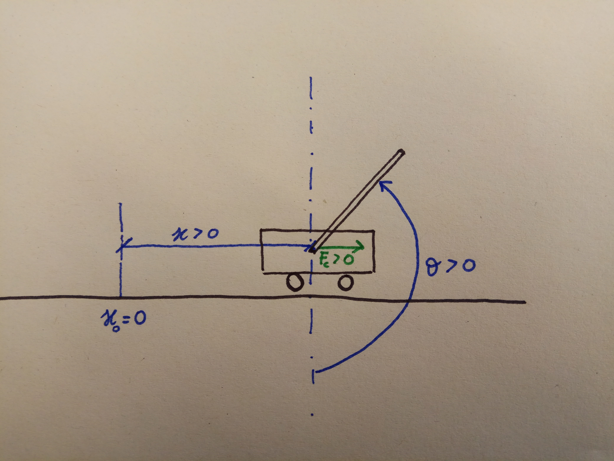

Cartpole Environment
================

Simulation and control environment for the cartpole.

Package contents
----------------
1. [model.pdf](documentation/model.pdf) physical model description
2. [base.py](base.py) common functionality (here is defined the reward function)
3. [cartpole.py](cartpole.py) simulated environment
4. [cartpole_rr.py](cartpole_rr.py) real robot environment
5. `example\*` example scripts

Brief Introduction to the Cartpole
----------------------------------

The carpole is a classic environment used in control and in reinforcement learning. 
It consists in a pole attached to a cart moving on a horizontal track.
The only actuated part of the system is the cart, 
which can be controlled usually by a horizontal force, or in our case by the voltage in 
input of the cart's engine. 

We propose two classic tasks:

1. `Pole balancing` 
2. `Pole swing-up`.

`Pole balancing` requires just to keep the pole balanced in vertical position without exceeding a certain treshold.
`Pole swing-up` requires to swing-up the pole from the resting position and then balance it. 

Our System
----------

Our Quanser platform, located in Room E303 S2|02, is a system provided with two poles with different lenght and mass. 
It is possible to easily mount the desired pole on the cart. 
For this reasons, we defined in our framework only two different environments:

1. `CartpoleStabRR-v0`
2. `CartpoleSwingRR-v0`.

For the simulation, instead, we need to specify the desired pendulum as the dynamics will change.
For this reasons we defined four environment:

1. `CartpoleStabShort-v0`
2. `CartpoleSwingShort-v0`
3. `CartpoleStabLong-v0`
4. `CartpoleSwingLong-v0`

where clearly "long" stands for the long pole, while "short" for the short one.

Observation of the state space
------------------------------

The overall system can be described with two entities: the position `x` of the cart on the track and the angle of the pole `theta`.

In order to control the system, we also need the derivates of this quantities, `x_dot` and `theta_dot`. In order to make the controller easier, and robust to angles which are out of the range (-pi, pi), we provide the cosine and the sine of `theta`.

**Observation's state description:**

Position| 0 | 1         | 2         | 3     | 4         |
--------|---|-----------|-----------|-------|-----------|
Semantic| x |sin(theta) |cos(theta) | x_dot | theta_dot |

Balancing Task for the Real System
----------------------------------

Every time we need to interact with the environment, we need to call the `reset` method, which will calibrate the system/.
This method will position the pendulum in the center of the track. 
The `reset` will not return however until the pendulum is positioned in upright position.
In this way, your controller will be activated as soon as the pole is already in upright position.

*The pendulum needs to be positioned slowly and gently in its upright position.*

Swing-up the task for the Real System
-------------------------------------

Here the reset function will position the cart in the center of the track, and a energy-based controller will try to stabilize as quickly as possible the pendulum in its resting position.
As soon as the pole is resting down, then the `reset` function will return and the controller is enabled to try to swing up the system.

*When using the real system, we strongly recommend to be promptly ready to turn off the amplifier if some unexpected or dangerous behaviour arises.*

Control
--------------------------
To control the real robot, you must be in the same local network
with the control PC of the double pendulum.
The easiest way is to connect directly via an Ethernet cable.
By default, the control PC has the IP address `192.172.162.1`.
The IP address can be changed in `quanser_robots/cartpole/__init__.py`.

To run the demo on the real robot, perform the following steps:

1. Start the control server on the control PC

        quarc_run -r \......\quarc_py_bridge_????.rt-win64

2. Launch the client application on your machine

        python3 quanser_robots/qube/examples/first_steps.py

3. At the end of the day, shut down the control server

       quarc_run -q \.....\quarc_py_bridge_????.rt-win64

### Control loop
The canonical way of using the real robot environment:
    
    import gym
    from quanser_robots import GentlyTerminating
    env = GentlyTerminating(gym.make('CartpoleSwingRR-v0'))
    ctrl = ...  # some function f: s -> a
    obs = env.reset()
    done = False
    while not done:
        act = ctrl(obs)
        obs, rwd, done, info = env.step(act)

Pay attention to the following important points:

- Reset the environment `env.reset()` right before running `env.step(act)`
  in a loop. If you forget to reset the environment and then send an action
  after some time of inactivity, you will get an outdated observationm, and the system will be not calibrated.

- Wrap the environment in the `GentlyTerminating` wrapper to ensure that
  a zero command is sent to the robot after an episode is finished.
  Qube always keeps executing the last command it received, which may damage
  the motor if constant voltage is applied for too long.
